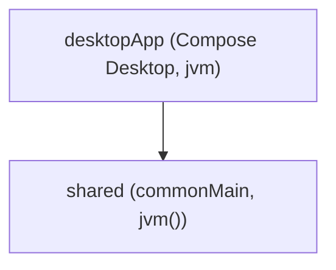

# Overview

ShogunAi is a **Kotlin Multiplatform** project with a single real target: **desktop JVM**.

## Modules



- **`shared`**: no content — the module was generated from the project's base template (`App`, `Greeting`, `Platform`), and that template was removed when the real GUI was built in `desktopApp` (see [`project-worktree-ui`](../process/openspec.md)). It's kept declared in case a second real target appears in the future.
- **`desktopApp`**: the desktop application (Compose Desktop), the UI (screens and ViewModels), and **all the domain and infrastructure of the worktree flow**.

!!! note "Why does the domain live in `desktopApp` and not in `shared`?"
    `shared` uses `jvm()` as its only target — there's no iOS, Android, or WASM in this project. Putting domain logic in a "shared" module that in practice only runs on one target would add a layer of indirection with no real benefit. See [design decisions](../decisions/index.md).

## Layers inside `desktopApp`

```
desktopApp/src/main/kotlin/app/luxion/shogunai/
├── domain/           # models, ports, and use cases — no infrastructure dependencies
│   ├── model/        # ProjectConfig, Project, BranchType, Worktree, WorktreeError, TerminalPreference, AgentLaunchConfig
│   ├── executor/      # ShellCommandExecutor, TerminalLauncher, TerminalEmulatorDetector ports + CommandResult
│   ├── io/            # FileManager, ProjectRepository ports
│   └── usecase/       # CreateWorktreeUseCase, RemoveWorktreeUseCase, ListWorktreesUseCase, OpenWorktreeTerminalUseCase, TerminalCommandBuilder
├── infrastructure/   # concrete implementations of the domain ports
├── ui/               # Compose screens, ViewModels, and navigation
├── AppContainer.kt   # wires domain + infrastructure for the UI, no DI framework
└── main.kt           # Compose Desktop app entry point
```

The domain is defined in terms of **ports** (interfaces) and doesn't know about `ProcessBuilder` or `java.nio.file` directly; that lets each port be swapped for a test double (`FakeShellCommandExecutor`, `FakeFileManager`) in use case tests, without touching disk or launching real processes.

See the detail of each layer:

- [Domain layer](domain.md)
- [Infrastructure layer](infrastructure.md)
- [UI layer](ui.md)
