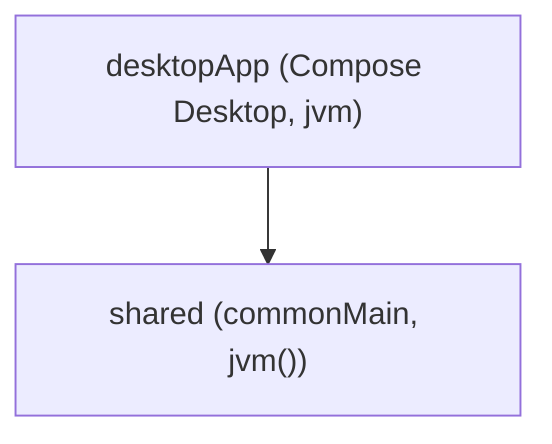

# Visión general

ShogunAi es un proyecto **Kotlin Multiplatform** con un único target real: **JVM de escritorio**.

## Módulos



- **`shared`**: sin contenido — el módulo se generó a partir de la plantilla base del proyecto (`App`, `Greeting`, `Platform`) y ese template se eliminó al construir la GUI real en `desktopApp` (ver [`project-worktree-ui`](../process/openspec.md)). Se mantiene declarado por si en el futuro aparece un segundo target real.
- **`desktopApp`**: la aplicación de escritorio (Compose Desktop), la UI (pantallas y ViewModels) y **todo el dominio y la infraestructura del flujo de worktrees**.

!!! note "¿Por qué el dominio vive en `desktopApp` y no en `shared`?"
    `shared` usa `jvm()` como único target — no hay iOS, Android ni WASM en este proyecto. Meter lógica de dominio en un módulo "compartido" que en la práctica solo corre en un target añadiría una capa de indirección sin beneficio real. Ver [decisiones de diseño](../decisions/index.md).

## Capas dentro de `desktopApp`

```
desktopApp/src/main/kotlin/app/luxion/shogunai/
├── domain/           # modelos, puertos y casos de uso — sin dependencias de infraestructura
│   ├── model/        # ProjectConfig, Project, BranchType, Worktree, WorktreeError, TerminalPreference, AgentLaunchConfig
│   ├── executor/      # puertos ShellCommandExecutor, TerminalLauncher, TerminalEmulatorDetector + CommandResult
│   ├── io/            # puertos FileManager, ProjectRepository
│   └── usecase/       # CreateWorktreeUseCase, RemoveWorktreeUseCase, ListWorktreesUseCase, OpenWorktreeTerminalUseCase, TerminalCommandBuilder
├── infrastructure/   # implementaciones concretas de los puertos de dominio
├── ui/               # pantallas Compose, ViewModels y navegación
├── AppContainer.kt   # cablea dominio + infraestructura para la UI, sin DI framework
└── main.kt           # punto de entrada de la app Compose Desktop
```

El dominio se define en términos de **puertos** (interfaces) y no conoce `ProcessBuilder` ni `java.nio.file` directamente; eso permite sustituir cada puerto por un doble de prueba (`FakeShellCommandExecutor`, `FakeFileManager`) en los tests de casos de uso, sin tocar disco ni lanzar procesos reales.

Ver el detalle de cada capa:

- [Capa de dominio](domain.md)
- [Capa de infraestructura](infrastructure.md)
- [Capa de UI](ui.md)
