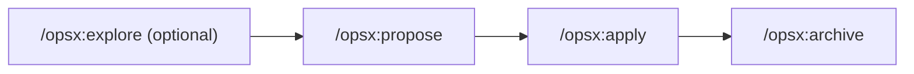

# OpenSpec

*Spec-driven development* framework: non-trivial changes are planned as versioned artifacts (proposal, design, tasks) **before** writing code, instead of being agreed upon in chat and lost.

## Flow



1. **Explore** (optional, `/opsx:explore`) — think out loud, compare options, sketch diagrams. No code is written and nothing is committed; it can only be captured in artifacts if the user asks for it.
2. **Propose** (`/opsx:propose "<description>"`) — creates `openspec/changes/<name>/` with `proposal.md` (what and why), `design.md` (how), and `tasks.md` (implementation steps).
3. **Apply** (`/opsx:apply <name>`) — implements `tasks.md`'s tasks one at a time, marking them `[x]` as they're completed. If a design issue comes up mid-implementation, work pauses and the artifact is updated instead of improvising.
4. **Archive** (`/opsx:archive <name>`) — moves the whole change to `openspec/changes/archive/YYYY-MM-DD-<name>/` and syncs the spec deltas with `openspec/specs/<capability>/spec.md`.

## On-disk structure

```
openspec/
├── config.yaml                        # schema, project context, per-artifact rules
├── changes/
│   ├── <change-name>/                 # active change
│   │   ├── proposal.md                # what and why
│   │   ├── design.md                  # how — design decisions
│   │   └── tasks.md                   # implementation steps, checklist
│   └── archive/
│       └── YYYY-MM-DD-<name>/         # completed changes, with archive date
└── specs/
    └── <capability>/spec.md            # living specification of each system capability
```

`openspec/config.yaml` supports a `context` block (stack, conventions, domain — shown to the AI when generating artifacts) and per-artifact-type `rules`. It's used to set that all OpenSpec artifacts (`proposal.md`, `design.md`, `tasks.md`, `spec.md`) are written in English, unlike the rest of the repo (code and `docs/`), which is in Spanish.

## Where design decisions live

Since adopting OpenSpec, **each change's design decisions are documented in its corresponding `design.md`**, and are preserved when archived under `openspec/changes/archive/`. That historical file is the source of truth for "why it was done this way" for future changes.

The log in [Design decisions](../decisions/index.md) captures what was decided **before** adopting OpenSpec (iteration 1). For later changes, check `openspec/changes/archive/` directly.
