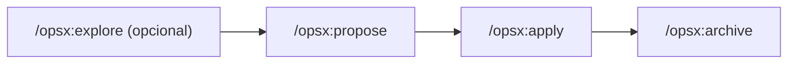

# OpenSpec

Framework de *spec-driven development*: los cambios no triviales se planifican como artefactos versionados (propuesta, diseño, tareas) **antes** de escribir código, en vez de acordarse en el chat y perderse.

## Flujo



1. **Explorar** (opcional, `/opsx:explore`) — pensar en voz alta, comparar opciones, dibujar diagramas. No se escribe código ni se compromete nada; solo se puede capturar en artefactos si el usuario lo pide.
2. **Proponer** (`/opsx:propose "<descripción>"`) — crea `openspec/changes/<nombre>/` con `proposal.md` (qué y por qué), `design.md` (cómo) y `tasks.md` (pasos de implementación).
3. **Aplicar** (`/opsx:apply <nombre>`) — implementa las tareas de `tasks.md` una a una, marcándolas `[x]` según se completan. Si aparece un problema de diseño a mitad de implementación, se pausa y se actualiza el artefacto en vez de improvisar.
4. **Archivar** (`/opsx:archive <nombre>`) — mueve el cambio completo a `openspec/changes/archive/YYYY-MM-DD-<nombre>/` y sincroniza los deltas de spec con `openspec/specs/<capability>/spec.md`.

## Estructura en disco

```
openspec/
├── config.yaml                        # schema, contexto de proyecto, reglas por artefacto
├── changes/
│   ├── <nombre-del-cambio>/           # cambio activo
│   │   ├── proposal.md                # qué y por qué
│   │   ├── design.md                  # cómo — decisiones de diseño
│   │   └── tasks.md                   # pasos de implementación, checklist
│   └── archive/
│       └── YYYY-MM-DD-<nombre>/       # cambios completados, con fecha de archivado
└── specs/
    └── <capability>/spec.md            # especificación viva de cada capacidad del sistema
```

`openspec/config.yaml` admite un bloque `context` (stack, convenciones, dominio — se le muestra a la IA al generar artefactos) y `rules` por tipo de artefacto. Se usa para fijar que todos los artefactos de OpenSpec (`proposal.md`, `design.md`, `tasks.md`, `spec.md`) se escriban en inglés, a diferencia del resto del repo (código y `docs/`), que va en español.

## Dónde viven las decisiones de diseño

A partir de la incorporación de OpenSpec, **las decisiones de diseño de cada cambio se documentan en su `design.md`** correspondiente, y quedan preservadas al archivarse en `openspec/changes/archive/`. Ese archivo histórico es la fuente de verdad de "por qué se hizo así" para cambios futuros.

El log en [Decisiones de diseño](../decisions/index.md) recoge lo decidido **antes** de adoptar OpenSpec (iteración 1). Para cambios posteriores, consulta directamente `openspec/changes/archive/`.
