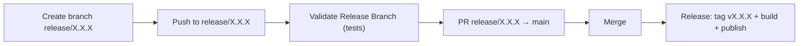

# Release process

How a new version of the desktop installer (`.dmg`/`.msi`/`.deb`) is cut and published.

## Flow



1. **Create the branch** `release/X.X.X` (where `X.X.X` is the version to publish) from `main`.
2. **Validate** — every push to `release/**` triggers the `Validate Release Branch` workflow (`.github/workflows/validate-release-branch.yml`), which runs `./gradlew test`. Used to iterate and fix issues before opening the PR.
3. **Open the PR** from `release/X.X.X` to `main` and review it like any other.
4. **Merge** — when a PR whose source branch matches `release/*` is merged, the `Release` workflow (`.github/workflows/release.yml`):
      1. creates and pushes the `vX.X.X` tag on the merge commit (the version comes from the branch name, no need to write it twice),
      2. creates the GitHub Release in **draft** mode with auto-generated notes (only once, before building),
      3. builds the installers on macOS/Windows/Linux (`packageReleaseDmg`/`Msi`/`Deb`) passing that version and uploads each one as an asset of that release, which stays in draft while the parallel upload is in progress,
      4. once all three installers are uploaded, publishes the release (takes it out of draft).

All of step 4 happens in a single CI run, with no manual intervention. The release is created as a draft and only published at the end because an already-published release is immutable for GitHub (it rejects new assets), and because generating the notes only once avoids duplicates if each matrix build regenerated them on its own.

## Installer version

`compose.desktop.application.nativeDistributions.packageVersion` (in `desktopApp/build.gradle.kts`) reads the Gradle property `appVersion`:

```kotlin
packageVersion = (findProperty("appVersion") as String?) ?: "0.0.0"
```

- In CI, `-PappVersion=X.X.X` (extracted from the tag or the `release/X.X.X` branch name) is always passed, so the published installer always matches the tag.
- In local builds (without that property) it falls back to the default `0.0.0`. jpackage requires strictly numeric versions (`MAJOR.MINOR.PATCH`), it doesn't accept suffixes like `-dev`.

## Manual path (escape hatch)

The `Release` workflow is also triggered by a direct tag push (`git tag vX.X.X && git push origin vX.X.X`), without going through a `release/` branch. Useful for one-off hotfixes, but the normal flow is the `release/*` branch flow described above.

## Why the tag doesn't trigger the workflow on its own in the merge case

If the merge job pushed the tag using the default `GITHUB_TOKEN`, GitHub would **not** trigger the same workflow's `on: push: tags` (a restriction to prevent loops). That's why the build and publish don't depend on that re-trigger: they run in the same run that creates the tag, using `needs` between jobs.
