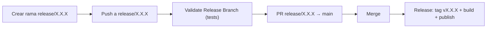

# Proceso de release

Cómo se corta y publica una nueva versión del instalador de escritorio (`.dmg`/`.msi`/`.deb`).

## Flujo



1. **Crear la rama** `release/X.X.X` (donde `X.X.X` es la versión a publicar) desde `main`.
2. **Validar** — cada push a `release/**` dispara el workflow `Validate Release Branch` (`.github/workflows/validate-release-branch.yml`), que corre `./gradlew test`. Sirve para iterar y corregir antes de abrir la PR.
3. **Abrir la PR** de `release/X.X.X` a `main` y revisarla como cualquier otra.
4. **Mergear** — al mergearse una PR cuya rama de origen matchea `release/*`, el workflow `Release` (`.github/workflows/release.yml`):
      1. crea y pushea el tag `vX.X.X` sobre el commit de merge (la versión sale del nombre de la rama, no hay que escribirla dos veces),
      2. compila los instaladores en macOS/Windows/Linux (`packageReleaseDmg`/`Msi`/`Deb`) pasando esa versión,
      3. publica los tres instaladores como assets de un GitHub Release con notas autogeneradas.

Todo el paso 4 ocurre en un único run de CI, sin intervención manual.

## Versión del instalador

`compose.desktop.application.nativeDistributions.packageVersion` (en `desktopApp/build.gradle.kts`) lee la propiedad de Gradle `appVersion`:

```kotlin
packageVersion = (findProperty("appVersion") as String?) ?: "0.0.0"
```

- En CI siempre se pasa `-PappVersion=X.X.X` (extraído del tag o del nombre de la rama `release/X.X.X`), así que el instalador publicado siempre coincide con el tag.
- En builds locales (sin esa propiedad) cae al default `0.0.0`. jpackage exige versiones estrictamente numéricas (`MAJOR.MINOR.PATCH`), no acepta sufijos como `-dev`.

## Vía manual (escape hatch)

El workflow `Release` también se dispara con un push de tag directo (`git tag vX.X.X && git push origin vX.X.X`), sin pasar por una rama `release/`. Útil para hotfixes puntuales, pero el flujo normal es el de ramas `release/*` descrito arriba.

## Por qué el tag no dispara el workflow por sí solo en el caso del merge

Si el job de merge pusheara el tag usando el `GITHUB_TOKEN` por defecto, GitHub **no** dispararía el `on: push: tags` del mismo workflow (restricción para evitar loops). Por eso el build y la publicación no dependen de ese re-trigger: corren en el mismo run que crea el tag, usando `needs` entre jobs.
