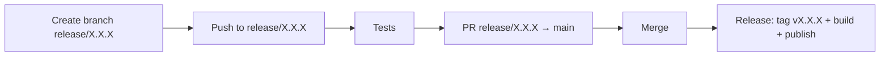

# Release process

How a new version of the desktop installer (`.dmg`/`.msi`/`.deb`) is cut and published.

## Flow


```mermaid
graph LR
    A["Create branch release/X.X.X"] --> B["Push to release/X.X.X"]
    B --> C["Tests"]
    C --> D["PR release/X.X.X → main"]
    D --> E["Merge"]
    E --> F["Release: tag vX.X.X + build + publish"]
```

1. **Create the branch** `release/X.X.X` (where `X.X.X` is the version to publish) from `develop`, write the headline feature of the release in `.github/release-title` (see [Release title](#release-title)) and its notes in `.github/release-notes/X.X.X.md` and `X.X.X.es.md` (see [Release notes](#release-notes)).
2. **Validate** — every push to `release/**` triggers the `Tests` workflow (`.github/workflows/tests.yml`), which runs `./gradlew test`. Used to iterate and fix issues before opening the PR. The same workflow also runs on every pull request targeting `develop` or an `epic/**` branch and on every push to `develop`, so regressions are caught before they reach a release branch.
3. **Open the PR** from `release/X.X.X` to `main` and review it like any other. While it is open, go through the [clean account rehearsal](clean-account-rehearsal.md) with the `.dmg` built from the branch.
4. **Merge** — when a PR whose source branch matches `release/*` is merged, the `Release` workflow (`.github/workflows/release.yml`):
      1. validates the version taken from the branch name (or the tag): it must be `X.Y.Z` with digits only, otherwise the run fails before building anything,
      2. runs the full test suite on the release commit on Linux, macOS and Windows (`.github/workflows/test-suite.yml`, the same one `Tests` uses). Nothing else runs until it passes,
      3. creates and pushes the `vX.X.X` tag on the merge commit (the version comes from the branch name, no need to write it twice) and creates the GitHub Release in **draft** mode with the release notes as its body (see [Release notes](#release-notes)) titled `vX.X.X — <headline>` (the headline read from `.github/release-title`, see [Release title](#release-title)), only once, before building,
      4. builds the installers on macOS Apple Silicon, macOS Intel, Windows and Linux (`packageReleaseDmg`/`Msi`/`Deb`) passing that version, with a read-only token. The macOS installers are built by `.github/workflows/macos-installer.yml`, which signs the app with the Developer ID certificate, renames each `.dmg` `ShogunAi-X.X.X-<arch>.dmg` (`arm64`/`x64`, taken from the runner's own architecture), signs it, notarizes it with Apple, staples the ticket and checks it with Gatekeeper (see [macOS signing and notarization](#macos-signing-and-notarization)). Each installer is kept as a workflow artifact,
      5. in parallel, builds the standalone command-line tool once on Linux (`:cli:distZip`, see [Command-line tool](../architecture/cli.md)) and keeps `shogun-X.X.X.zip` as an artifact,
      6. once all four installers and the zip are built, a job that holds only the permissions to sign attestations (it doesn't check out the repository or run the build) generates a signed build provenance attestation for each of them (`actions/attest`). The release isn't published until every attestation exists,
      7. once every attestation exists, the only job that writes to the repository writes `SHA256SUMS` with the checksum of every asset, uploads everything to the draft and publishes the release (takes it out of draft),
      8. regenerates the Homebrew Cask from `.github/homebrew/shogunai.rb` with the new version and the `.dmg` checksums read from `SHA256SUMS`, and pushes it to the `LuxionServer/homebrew-shogunai` tap. The Cask installs the app and links its launcher as the `shogun` command,
      9. regenerates `bucket/shogunai.json` in the `LuxionServer/scoop-shogunai` bucket from `.github/scoop/shogunai.json` with the new version and the `.msi` checksum read from `SHA256SUMS`, and pushes it,
      10. opens a pull request to `microsoft/winget-pkgs` updating `LuxionServer.ShogunAi` to the new `.msi` (`winget-releaser` action).

Steps 8, 9 and 10 run in parallel and are independent: if one fails, the release stays published and the others still run.

The whole flow from step 4 happens in a single CI run, with no manual intervention. The release is created as a draft and only published at the end because an already-published release is immutable for GitHub (it rejects new assets), and because writing the notes only once avoids duplicates if each matrix build wrote them on its own.

## Release title

Every release reads its title from `.github/release-title`: the first line of that file is the headline feature, and the workflow titles the release `vX.X.X — <headline>`. For example, 0.9.0 shipping multi-repo support is released as `v0.9.0 — Multi-repo support`.

Write it when creating the release branch, in the same commit that bumps the version. If the file is empty or missing, the workflow falls back to the plain `vX.X.X` title and logs a warning, so a forgotten title never blocks a release — it is still worth an entry in the release notes.

## Release notes

Every release has notes written by hand for its users, in English and Spanish, in two files named after the version: `.github/release-notes/X.X.X.md` and `.github/release-notes/X.X.X.es.md`. Write them on the release branch, in the same commit as `.github/release-title`, and review them in the release pull request. Naming them after the version means a forgotten update can't republish the previous release's notes, and the folder keeps the history of every release.

How to write them:

- Describe what changes for the person using ShogunAi, in plain language: what they can do now, what works better, what was fixed.
- No pull request numbers, authors, branch names, internal class names or OpenSpec change names.
- Short: a heading per group (for example "What's new" and "Fixes"), one bullet per change, the feature in bold followed by a sentence or two.
- The Spanish file says the same as the English one; it isn't a summary.
- Only headings (`#` to `###`), bullets (one level of nesting), paragraphs, `**bold**`, `` `code` ``, links and bare `https://` URLs: the app renders that much and shows anything else as plain text.

For example:

```markdown
## What's new

- **Release notes inside the app.** Click the ⓘ icon on the update notice to read what a new version brings, in your language.

## Fixes

- Removing a worktree on Windows no longer fails on very long paths.
```

### Release body format

The workflow builds the GitHub release body from both files: the English notes visible and the Spanish ones in a collapsed "Español" section. Each language is enclosed in HTML comments, which GitHub doesn't render:

```markdown
<!-- shogunai:notes:en -->

…contents of X.X.X.md…

<!-- /shogunai:notes:en -->

<details>
<summary>Español</summary>

<!-- shogunai:notes:es -->

…contents of X.X.X.es.md…

<!-- /shogunai:notes:es -->

</details>
```

The desktop app reads each language between its markers to show the notes in the update notice (see [Desktop app](../guide/desktop-app.md)), so don't change the markers without changing the app. Releases published before this format only have GitHub's generated notes; the app shows them without authors, pull request links or the "Full Changelog" line.

If `X.X.X.md` is missing, the workflow publishes the release with GitHub's generated notes and logs a warning naming the missing files, so forgotten notes never block a release. If only `X.X.X.es.md` is missing, the body has only the English section and the workflow logs a warning; the app then shows the English notes to Spanish users.

## macOS signing and notarization

Every macOS `.dmg` is signed with the project's Developer ID Application certificate under the hardened runtime (entitlements in `desktopApp/macos/entitlements.plist`), notarized with `notarytool` using an App Store Connect API key, and stapled, so Gatekeeper opens it without warnings. A missing secret or a rejected notarization fails the macOS build and the release stays in draft: an unsigned installer is never published. The notary log is printed in the job when Apple rejects a submission.

The build only signs when it's given an identity (`-PmacSigningIdentity=<name without the "Developer ID Application: " prefix>`, plus `-PmacSigningKeychain=<path>` if the certificate isn't in the default keychain). Local builds and tests stay unsigned and need nothing.

The workflow reads five Actions secrets:

- `MACOS_CERTIFICATE_P12`: the certificate with its private key, exported from Keychain Access as `.p12` and base64-encoded (`base64 -i <file>.p12 | gh secret set MACOS_CERTIFICATE_P12 -R LuxionServer/ShogunAi`).
- `MACOS_CERTIFICATE_PASSWORD`: the password chosen when exporting the `.p12`.
- `MACOS_NOTARY_KEY`: the content of the App Store Connect team API key's `.p8` file, created with the Developer role (`gh secret set MACOS_NOTARY_KEY -R LuxionServer/ShogunAi < AuthKey_<id>.p8`).
- `MACOS_NOTARY_KEY_ID` and `MACOS_NOTARY_ISSUER_ID`: the key's ID and the issuer ID shown on App Store Connect's API keys page.

The signing identity is read from the certificate, so no name or team ID is stored in the repository. Delete the local `.p12` and `.p8` once the secrets are set.

To check the setup without releasing, run the `macOS installer` workflow by hand (`gh workflow run macos-installer.yml -R LuxionServer/ShogunAi -f version=X.Y.Z`): it uploads both signed and notarized `.dmg` files as workflow artifacts and touches no release, tag or package manager.

- **Renewing the certificate**: Developer ID certificates last five years. Before it expires, create a new one from a CSR in Keychain Access at developer.apple.com, export it as `.p12` and replace `MACOS_CERTIFICATE_P12` and `MACOS_CERTIFICATE_PASSWORD`. Installers already published keep opening, because their signatures are timestamped.
- **Rotating the API key**: create a new team key in App Store Connect, replace `MACOS_NOTARY_KEY` and `MACOS_NOTARY_KEY_ID`, check with a manual run, then revoke the old key.

## Windows package managers

One-time setup by the maintainer, before the first release that runs steps 8 and 9 (until it's done, those jobs fail without affecting the release):

1. Create the public repository `LuxionServer/scoop-shogunai` with a `bucket/` folder and a README with the install commands.
2. Create a fine-grained token with `Contents: read and write` on that repository only and store it as the `SCOOP_BUCKET_TOKEN` secret.
3. Submit the first winget version by hand with `wingetcreate new https://github.com/LuxionServer/ShogunAi/releases/download/v<version>/ShogunAi-<version>.msi`, using the identifier `LuxionServer.ShogunAi`, and wait for it to be merged (the action can only update an existing package).
4. Create a classic token with `public_repo` and store it as the `WINGET_TOKEN` secret.

The `.msi` declares a fixed upgrade code (`upgradeUuid` in `desktopApp/build.gradle.kts`), so a newer `.msi` replaces the installed version; don't change it. jpackage strips `java.exe` from the bundled runtime, so `desktopApp/build.gradle.kts` copies it back from the build JDK after `createRuntimeImage`: the Scoop `shogun` command runs it.

After a Compose Desktop or jpackage upgrade, check on Windows that the `.msi` layout still matches the Scoop manifest: install from the rendered manifest (`scoop install` with a local copy of `.github/scoop/shogunai.json` with the version and `sha256` filled in) and run `shogun --version`.

## Release checksums

Every release includes a `SHA256SUMS` file. To verify a download: `shasum -a 256 -c SHA256SUMS --ignore-missing`.

## Build provenance

Every installer and the CLI zip have a signed build provenance attestation that ties them to the release workflow run and the commit they were built from. To verify a download: `gh attestation verify ShogunAi-X.X.X-arm64.dmg --repo LuxionServer/ShogunAi`. Releases published before the `release-provenance-strict-warnings` change have no attestation.

## Pinned actions

Actions outside `actions/*` and `gradle/*` are referenced by commit SHA, because they receive secrets. Dependabot (`.github/dependabot.yml`) proposes updates weekly.

| Action | Tag | Commit |
|---|---|---|
| `vedantmgoyal9/winget-releaser` | `v2` | `b7370d4d152efdce803a26cc6ca9eee58cb2ad54` |

## Installer version

`compose.desktop.application.nativeDistributions.packageVersion` (in `desktopApp/build.gradle.kts`) reads the Gradle property `appVersion`:

```kotlin
packageVersion = (findProperty("appVersion") as String?) ?: "0.0.0"
```

- In CI, `-PappVersion=X.X.X` (extracted from the tag or the `release/X.X.X` branch name) is always passed, so the published installer always matches the tag.
- In local builds (without that property) it falls back to the default `0.0.0`, which is also the version shown in the app (`BuildInfo.VERSION`, generated by the `generateBuildInfo` task, which reruns whenever `appVersion` changes).
- The macOS bundle version is derived from it by one rule, `macBundleVersion` in `desktopApp/build.gradle.kts`: major + 1 (`0.9.0` → `1.9.0`, `1.4.0` → `2.4.0`). It is always valid for macOS, increases with the release version and never collides. The `.dmg` files are named after the release version, never the bundle version.
- jpackage requires strictly numeric versions (`MAJOR.MINOR.PATCH`), it doesn't accept suffixes like `-dev`. On macOS the first number must also be greater than zero, so packaging locally (`packageDmg`, `createDistributable`) needs an explicit version, e.g. `./gradlew :desktopApp:packageDmg -PappVersion=1.0.0`; `./gradlew :desktopApp:run` works with the default.

## Manual path (escape hatch)

The `Release` workflow is also triggered by a direct tag push (`git tag vX.X.X && git push origin vX.X.X`), without going through a `release/` branch. Useful for one-off hotfixes, but the normal flow is the `release/*` branch flow described above.

## Why the tag doesn't trigger the workflow on its own in the merge case

If the merge job pushed the tag using the default `GITHUB_TOKEN`, GitHub would **not** trigger the same workflow's `on: push: tags` (a restriction to prevent loops). That's why the build and publish don't depend on that re-trigger: they run in the same run that creates the tag, using `needs` between jobs.
